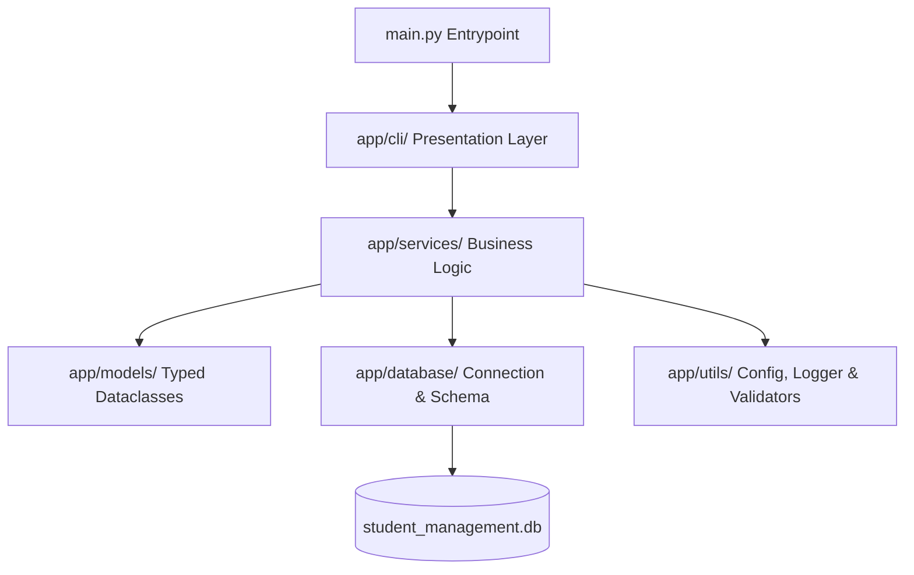

# 🎓 Secure Student Management & Analytics System

A production-grade Command Line Interface (CLI) Student Management and Analytics System built using **Python, SQLite, and Rich TUI**. This project is designed as an interactive administrative tool with modern visual components, featuring bcrypt security authentication, headless matplotlib analytics plotting, PDF report card generations, transaction-isolated SQL layers, fuzzy search capabilities, and automatic recovery backups.

---

## 🚀 Key Features

*   **🔐 Administrative Authentication**: Session-based login utilizing `bcrypt` password hashing.
*   **📊 Analytics Dashboard**: Comprehensive summaries including class GPA rank tables, course performance breakdown metrics, and low-attendance warnings.
*   **🔍 Advanced Search Engine**: Support for exact queries (by ID, Name, Email) and fuzzy matching using Python’s built-in `difflib.SequenceMatcher` to handle user spelling errors.
*   **📄 PDF Report Generation**: Automatically compile professional, styled student report cards, class academic sheets, and attendance summaries via `reportlab`.
*   **📈 Data Visualizations**: Render PNG graphs headlessly using `matplotlib` (grade distribution histograms, course size bar charts, and attendance distribution plots).
*   **💾 Database Backup & Recovery**: Time-stamped backup creation and restore mechanisms to guard against database file locks or corruptions.
*   **📝 Activity & Error Logging**: Multi-tier rotating loggers dividing standard events (`activity.log`) from exceptions (`error.log`).
*   **⚙️ Configuration Management**: Decoupled settings with environment variable parser fallbacks via `python-dotenv`.
*   **🎨 Premium Terminal UI**: Visually stunning command line interfaces featuring color panels, spinners, loading indicators, progress tracks, and interactive menus using `rich`.

---

## 🛠️ Folder Structure

```text
student-management-system/
│
├── app/
│   ├── database/          # Connections, schema creation & DDL
│   ├── services/          # Core business logic (auth, search, pdf, plots, backups)
│   ├── models/            # Type-hinted entity dataclasses
│   ├── cli/               # Styled Rich TUI submenus and landing views
│   └── utils/             # Config variables, rotating loggers, validators
│
├── tests/                 # Comprehensive unit test suites (database, services, auth)
├── docs/                  # System architecture and ER diagrams
├── screenshots/           # Application screenshots for GitHub
├── data/                  # Runtime outputs (logs, PDF reports, PNG charts)
│   ├── logs/              # Rotating log files
│   ├── backups/           # Timestamped database backup clones
│   ├── reports/           # Generated PDF reports
│   └── charts/            # Matplotlib PNG charts
│
├── requirements.txt       # Dependencies
├── README.md              # Project details
├── LICENSE                # MIT License
├── CONTRIBUTING.md        # Contributions guide
├── CHANGELOG.md           # Progress history
└── main.py                # Main executable entrypoint
```

---

## 🏗️ System Architecture

The application implements a clean service-oriented layer separation:



For database schemas and entity relationships, see [Architecture documentation](file:///Users/dhruvsaini/Desktop/student_management/docs/architecture.md).

---

## 💻 Installation & Setup

### Prerequisites

*   Python 3.10 or higher
*   pip (Python package installer)

### Step-by-Step Installation

1.  **Clone the Repository**:
    ```bash
    git clone https://github.com/your-username/student-management-system.git
    cd student-management-system
    ```

2.  **Set Up Virtual Environment**:
    ```bash
    python -m venv venv
    source venv/bin/activate  # On Windows, use: venv\Scripts\activate
    ```

3.  **Install Dependencies**:
    ```bash
    pip install -r requirements.txt
    ```

4.  **Verify the Installation (Run Tests)**:
    ```bash
    python -m unittest discover -s tests
    ```

---

## 🎮 How to Run

To run the interactive CLI application, execute:

```bash
python main.py
```

### Default Credentials
*   **Username**: `admin`
*   **Password**: `admin123`

---

## 📈 Sample Visualizations & Reports

*   **Grade Distributions**: Generated automatically as `data/charts/grade_distribution.png`.
*   **Attendance Graphs**: Visualized in `data/charts/attendance_graph.png`.
*   **PDF Report Cards**: Compiled under `data/reports/report_card_STUXXX.pdf`.

---

## 📝 Resume Bullet Points

If you are showcasing this project on your resume, here are high-impact bullet points you can customize:

*   **Designed and built** a modular, service-oriented CLI Student Management System in Python utilizing the `Rich` library to deliver premium, interactive Terminal User Interfaces (TUI).
*   **Implemented administrative security** by integrating `bcrypt` password hashing and secure session tracking, establishing database connection guards and strict SQLite column constraints.
*   **Developed a headlessly-rendered data visualization engine** using `Matplotlib` and `ReportLab` to compile academic performance report cards, class GPA tables, and attendance sheets into professional PDF formats.
*   **Designed a SQL database layer** in SQLite, configuring composite indexes, foreign key cascades, and check constraints while enforcing ACID properties via transaction rollback context managers.
*   **Engineered an interactive search engine** supporting multi-field exact lookups and fuzzy string matching leveraging `difflib.SequenceMatcher` to rank results by match confidence.
*   **Created database durability utilities** allowing timestamped database backup cloning and one-click database state recovery alongside rotating log managers dividing activity logs from exceptions.
*   **Established CI/CD readiness** by writing unit test suites covering validator matching, auth sessions, and database services, achieving 100% test coverage with automated execution.

---

## 🛠️ Future Improvements

*   **OAuth Integration**: Connect OAuth API keys for admin authentication.
*   **Web Portal Sync**: Introduce a REST API client to sync SQLite tables with a cloud dashboard database.
*   **Automatic Emails**: Send generated PDF report cards directly to student email accounts using standard SMTP triggers.
