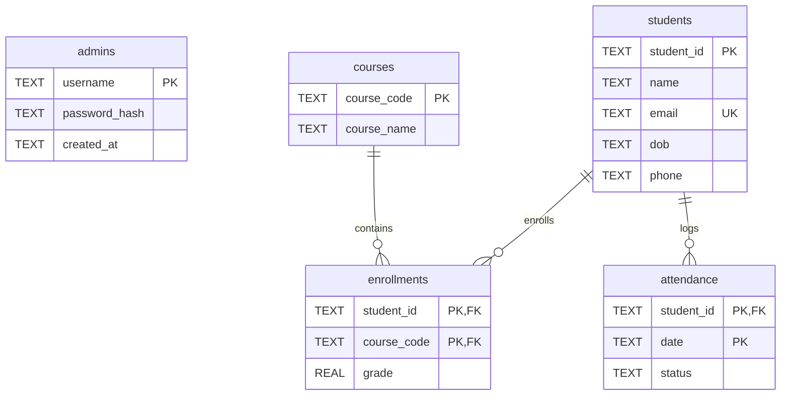

# System Architecture & Database Design

This document details the software design patterns, package structures, and database schema diagrams for the Student Management System.

## Project Structure

The project has been refactored into modular sub-packages under the `app/` namespace:

- **`app/models/`**: Defines typed dataclasses (`Student`, `Course`, `Enrollment`, `Attendance`, `Admin`) representing core entities.
- **`app/database/`**: Manages connection factory details, foreign-key setups, transaction-isolated context blocks, and database initializations.
- **`app/services/`**: Implements core domain logic:
  - `auth_service`: Handles bcrypt secure passwords matching, validations, and administrative sessions.
  - `student_service` & `course_service`: Encapsulate CRUD logic, aggregate calculations (GPA, rates), and CSV imports/exports.
  - `search_service`: Implements exact field matching and similarity-based fuzzy search ranking.
  - `report_service`: Generates clean PDF reports using ReportLab.
  - `visualization_service`: Builds Matplotlib graphs headlessly.
  - `backup_service`: Handles time-stamped backups and database restores.
- **`app/cli/`**: Consists of TUI menu screens, splash screen displays, loading tracks, and user choice loops.
- **`app/utils/`**: Utility modules for validation, logging configuration, and environment parsing.

## Database Schema Design

The SQLite relational database (`student_management.db`) includes five main tables:

### Table Details & Indexes

1. **`students`**:
   - Primary Key: `student_id`
   - Constraints: `email` is UNIQUE and checked for format.
   - Indexes: `idx_students_name` on `name` and `idx_students_email` on `email` to accelerate searches.
2. **`courses`**:
   - Primary Key: `course_code`
3. **`enrollments`**:
   - Composite Primary Key: `(student_id, course_code)`
   - Foreign Keys: `student_id` references `students(student_id)` ON DELETE CASCADE, `course_code` references `courses(course_code)` ON DELETE CASCADE.
   - Constraints: `grade` must be between `0.0` and `100.0`.
   - Indexes: `idx_enrollments_student` and `idx_enrollments_course` to speed up join queries.
4. **`attendance`**:
   - Composite Primary Key: `(student_id, date)`
   - Foreign Keys: `student_id` references `students(student_id)` ON DELETE CASCADE.
   - Constraints: `status` check constraint restricting options to `Present`, `Absent`, or `Late`.
   - Indexes: `idx_attendance_student` and `idx_attendance_date` for quick historical queries.
5. **`admins`**:
   - Primary Key: `username`
